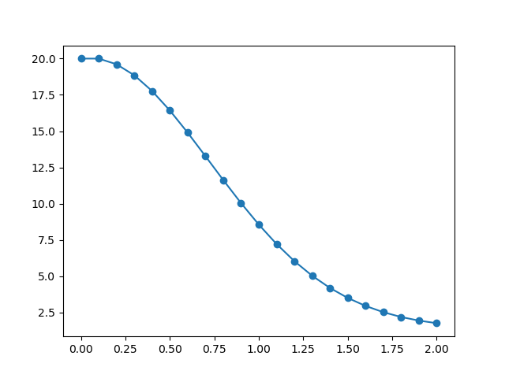

# Eulers-Method-Python

Euler's Method approximation in Python.

## Usage

Import the library, then call the `evaluate` method to generate a table of data.

Call the `print` method to print out the points to the console.

Call the `graph` method to graph the equation.

Parameters:
* Derivative expression
* Starting X
* Starting Y
* Ending X
* Step size

Example:
```python
import euler
calc = euler.EulerCalculator()
points = calc.evaluate(
    derivative="x-2ysin(x)", startX=0, startY=20, endX=2, stepSize=0.1
)
calc.print(points)
calc.graph(points)
```

Output:

```
  x         y
---  --------
0    20
0.1  19.6107
0.2  18.8515
0.3  17.7673
0.4  16.4235
0.5  14.8987
0.6  13.2762
0.7  11.6357
0.8  10.0463
0.9   8.56238
1     7.22138
1.1   6.04423
1.2   5.03754
1.3   4.19675
1.4   3.50961
1.5   2.95945
1.6   2.52781
1.7   2.19646
1.8   1.94866
1.9   1.76985
2     1.64799
```